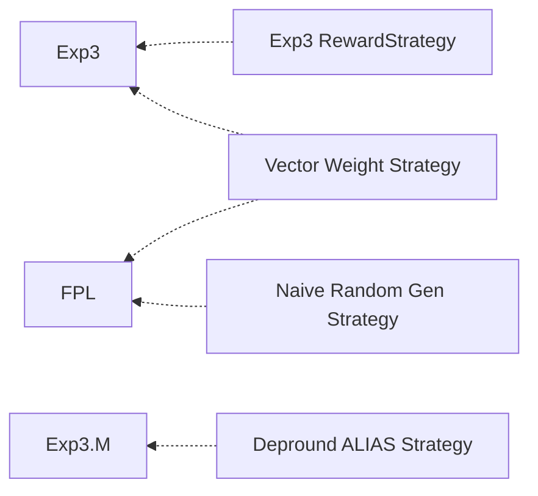

# efficient-multi-armed-bandits
This time it's super quick.

## Dependencies
- https://github.com/vincentlaucsb/csv-parser?ref=bestofcpp.com#integration
- Google benchmark 

## Variants

```mermaid
  graph RL;
  Exp3Bandit[Exp3]
  VectorWeightStrategy[Vector Weight Strategy]-.->Exp3Bandit
  Exp3RewardStrategy[Exp3 RewardStrategy]-.->Exp3Bandit
  Exp3m[Exp3.M]
  DepRoundALIASStrategy[Depround ALIAS Strategy]-.->Exp3m
  FPL
  NaiveRandomGenStrategy[Naive Random Gen Strategy]-.->FPL
  VectorWeightStrategy[Vector Weight Strategy]-.->FPL
```
